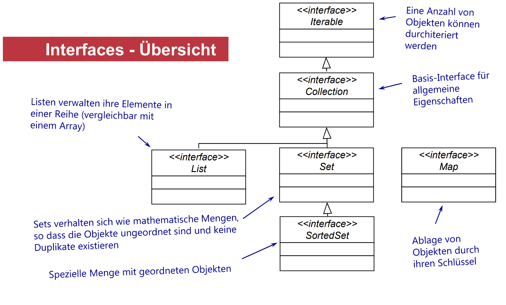

# Collection Framework
Dieses Youtube [Video](https://m.youtube.com/watch?v=viTHc_4XfCA&pp=ygUaamF2YSBjb2xsZWN0aW9ucyBmcmFtZXdvcms%3D) geht sehr gut darauf ein was das Collection Framework anbietet um mit Datenstrukturen zu arbeiten. *Nuemit* bezieht sich grundlegend viel auf dieses Video in dieser aufarbeitung.

Die Vorlesungsthemen die Abgebildet werden lauten:
- **Begriffsbildung**
- **Collection-API**
- **Collections & Iteration**
- **Vergleich von Objekten**
  - **Interface Comparable**
  - **Interface COmparator**

Wenn über Collections geredet wird, müssen wir über Datenstrukturen reden. Die Relevantesten sind vermutlich `List, Linked-List, Arrays, Binäre-Bäume, Hashtables und Hashmaps`

## Grundlegende Erläuterung nach Prof
Bei einer Objektverwaltung weiß man vor der Implementierung nicht immer genau, wie viele Objekte angelegt werden, so entstehen Probleme wenn man neue Objekte hinzufügen möchte. Ein Weiterer Punkt der Betohnt wird ist, dass man auch ab und zu, objekte aus einer Liste, löschen möchte.

Hier kommt das Collection Framework ins Spiel, `Collectoins` sind **Container**, die Elemente eines Typs aufnehmen. Sie haben keine feste Größe und können daher eine beliebige anzahl an Elementen aufnehmen. Zudem bietet das Framework eine vielzahl an Methoden um Objekte zu verwalten.

**Zusammenfassung**
- Unbestimmte Größe
- Beliebiger Datentyp
- Methoden zur Objektverwaltung

### Definition Framework nach Prof
- Jedes Framework gibt einen Bestimmten Aufbau, bestimmte Abläufe und bestimmte Nutzungsmöglichkeiten vor, das nennt man "Software ARchitektur".

Das Collection Framework bietet:
- Interfaces
- Algorithmen
- Standard-Implementierungen

Und gibt in vielen Kommentaren an, welche "Verträge / Contracts" bei der Implementierung eingehalten werden müssen.

# Grundlegendes
Das `Collection` Framework bietet die folgenden "Interfaces" in dieser Hierarchie an:

- `Iterable`
  - `Collection`
    - **Sets**
      - HashSet
      - TreeSet
      - LinkedHashSet
    - **Lists**
      - ArrayList
      - LinkedList
    - **Queues**
      - PriorityQueue

Dabei ist es Wichtig zu erwähnen, das diese in die untergruppen von `java.util.List`, `java.util.Set` und `java.util.Map` einzuteilen sind.

`java.util.List` Beschreibt eine Reihung von Objekten.

Eine Implementierung für `java.util.ArrayList` sieht folgendermaßen aus
```java
import java.util.ArrayList;

public class Main {
    public static void Main(String[] args) {
        ArrayList<String> people = new ArrayList<>();
        
        people.add("John");
        people.add("Dave");
        people.add("Sam");

        people.remove("Dave");
        // oder
        people.remove(1);
    }
}
```

Die remove Operation, hat eine Zeitkomplexität von O(N).

`java.util.Set` ist mit Mathemathischen Mengen zu vergleichen, in den ein Element oder Objekt nur einmal vorkommen darf.

`java.util.Map` sind Schlüssel- oder Element- Paare, so dass jedes Objekt unter einem Namen oder Schlüssel zu referenzieren ist.



Wir gehen davon aus, das folgende Klassen eine rolle in der Klausur spieln können:
* ArrayList
* LinkedList
* HashSet
* TreeSet

Alles was die TypSicherheit von `Generics` betrifft findet ihr [Hier](/Generics), das ist auch ein Prägnanter teil des Collection Frameworks. 

**Definition: Entwurfsmuster** sind bewährte generische Lösung für ein immer
wiederkehrendes Entwurfsproblem, das in bestimmten Situationen
auftritt. 
Das Collection Framework setzt das Entwurfsmuster `Iterator` ein.

Implementierungen des Interface `java.lang.Iterable` können als Iterator-Typ einer foreach-Schleife genutzt werden. Zudem liefern sie für die Verwalteten Objekte, einen Aufzählungsoperator `java.util.Iterator` zurück.
Dabei verweist ein **Iterator** nach der Initialisierung immer auf den Anfang einer FOlge und kann jederzeit überprüfen ob es ein Nachfolgeelement gibt. Mit der Methode `next()` wird das direkte Nachfolgeelement zurückgegeben und springt dann zu diesem.

Der `ListIterator` erbt vom `Iterator`, dieser Iterator bietet für alle `List`-Typen die möglichkeit, eine Liste rückwärts zu durchlaufen. Er arbeitet mit den Indizes der Elemente und kann somit bei der Initialisierung auf ein Start-Ellement gesetzt werden.

Beispielimplementation
```java
import java.util.List;
// ...

List<CD> cdSammlung = new LinkedList<CD>();
CD aktuelleCD;

// Objekterzeugung für Iterator
Iterator<CD> cdIterator = cdSammlung.iterator();

// Schleife: Überprüfen ob noch ein element in Collection ist.
while(cdIterator.hasNext()) {
    aktuelleCD = cdIterator.next();
}
```
Für jede `Collection` lassen sich beliebig viele Iteratoren erzeugen.
- Iterator iterator()
mit deren Hilfe, alle Elemente einer Collection vorwärts (ListIterator auch Rückwärts) durchlaufen werden können.
- Die im `Collection`-Framework enthaltenen Klassen Implementieren alle das `Iterator-Interface` als private [Member-Klassen](https://github.com/Nuemit/Pr-fungsvorbereitung-II/tree/master/01_Modellierung-Done/PDF#instanz--und-klassen-member). 
- Da die Iterator-Member-Klasse privat deklariert ist und Ihre Objekte nur über Interface-Referenzen nach außen liefert, bleibt die Konkrete Iterator Klasse von außen unsichtbar.
- Werden operationen auf einer Collection ausgeführt, werden alle Iteratoren ungültig, bis auf den iterator, über den die Operation ausgeführt wurde. Die weitere Nutzung eines Operators der nicht die Operation durchgeführt hat, würde die `ConcurrentModificationException` werfen.

## Iteration - foreach-Schleife
Man kann mit `for` neben einer normalen Schleife, ebenso eine `foreach` schleife für Arrays und Collections erzeugen. Diese Schleifen sind spezialisierte `for`-Schleifen, um alle Elemente eines Arrays/einer Collection sequentiell zu durchlaufen.

Das Sprachkonstrukt einer foreach Schleife sieht folgendermaßen aus:
```java
for(DatenTyp element: collectionName) {
    // Anweisungen
}
```

Ein Konkretes beispiel für das CollectionFramework findet ihr auch im Beispielcode.
```java
List<String> namen = new LinkedList<>();

namen.add("Anna");
namen.add("John");
namen.add("Komiker")

namen.forEach(name -> System.out.println(name));
```

Diese Methode kann einen `NullPointerException` auslösen, wenn es keine Anweisung gibt.

Dise Form einer `foreach` wird auch eine *interne Iteration* genannt. Java Entwickler haben die möglichkeit, die `forEach` Methode in einem Iterable-Container geeignet zu überschreiben, um Effizienzgewinne zu erzielen.

## Vergleich von Objekten
Objekte können verglichen werden, um Sie in einer sortierbaren Collection zu sortieren.

Hierzu gibt es die Möglichkeit
- Dass die zu Sortierenden Objekte, das Interface `Comparable` zu implementieren
- Dass die sortierbare Collection einen `Comparator` besitzt.

### Comparable - `java.lang.Comparable`
Dieses Interface erlegt den Objekten jeder Klasse, die das Interface implementiert, eine totale Ordnung auf. Diese Ordnung wird als die "Natürliche Ordnung" der Klasse angesehen und die compareTo mEthode der Klasse wird als ihre natürliche Vergleichsmethode genannt.

Der Contract den jede Klasse mit dem interface eingeht ist, dass die Methode
```java
// Compares this object with the specified object for order.
int compareTo(T o)
```
Implementiert sein muss. Bekannt Beispiele sind `String`, `Date`, `LocalDate`, `BigDecimal` und alle Wrapper-Klassen für einfache Datentypen.

Die Implementierung der Methode gibt einen `int`-Wert zurück, der die Sortierreihenfolge anzeigt:
- Negativer Wert: Das aktuelle Objekt ist **kleiner** als das übergebene Objekt.
- Null: Die beiden Objekte sind **Gleich**
- Positiver Wert: Das aktuelle Objekt ist **größer** als das übergebene Objekt.

Zudem sollten die Methoden `compareTo()` und `equals()` Gleichheit übereinstimmend definieren.
Im Gegensatz zu `equals()`, das bei `null` den wert `false` zurück gibt, sollte die MEthode, wenn der Parameter `o = null`ist, mit einer `NullPointerException` reagieren.
Im Gegensatz zu `equals()`, das bei klassen-Unverträglichkeit `false` zurück gibt, sollte die Methode bei Klassen-Unverträglichkeit mit `ClassCastException` reagieren.

**Beispiel**
```java
public. class Auto implements Comparable<Auto> {
    // Variablen und Konstruktor
    // ...

    // Die compareTo() - Methode muss implementiert werden!
    @Override
    public int compareTo(Auto anderesAuto) {
        // Vergleich von z.B. Baujahr
        // Die Differenz gibt direkt die richtige Reihenfolge an.
        return this.getBaujahr() - anderesAuto.getBaujahr();

        // Alternativ und sicherer (um Integer Overflow zu vermeiden)
        return Integer.compare(this.getBaujahr(), anderesAuto.getBaujahr());
    }
}
```
`java.lang.Comparable` ist für die Natürliche Reihenfolge eines Objekts gedacht. Das kriterium legt der Entwickler selbst fest.

### Comparator - `java.util.comparator`
Das Interface `Comparator` sollte definiert werden, wenn eine Klasse keine natürliche Ordnung hat oder eine natürliche Ordnung einer Klasse durch eine eigene (Zusätzliche) ersetzt werden soll.

Der contract zwingt der Klasse auf
```java
int compare(Object o1, Object o2);
```
zu implementieren. Dabei unterliegt `compare()` den gleichen Bedingungen wie `compareTo()`. Eine Instanz der Klasse `Comparator` kann an sortierte Kollektionen wie z.B. `TreeSet` oder Methoden wie `Collections.sort(List<T> list, Comparator<? super T> c)` übergeben werden.

Die Implementierung der Methode gibt einen `int`-Wert zurück, der die Sortierreihenfolge anzeigt:
- Negativer Wert: Das aktuelle Objekt ist **kleiner** als das übergebene Objekt.
- Null: Die beiden Objekte sind **Gleich**
- Positiver Wert: Das aktuelle Objekt ist **größer** als das übergebene Objekt.

Dieses Interface ist ein "Funktionales" Interface, bedeutet - dass es nicht nur die Abstrakte Methode `compare` liefert, sondern auch `default` und `statische` Mehtoden anbietet. 

So zum Beispiel die Methode `comparing`, diese nimmt eine Methode `keyExtraktor` entgegen, die aus einem Objekt einen Comparable-Schlüssel extrahiert, und liefert einen `Comparator` zurück.

**Beispiel aus der Vorlesung**
```java
public static void main(String[] args) {
    List<CustomerVO> arrayListCustomers = new ArrayList<CustomerVO>();
    // Liste mit Objekten befüllen

    // Sortieren nach natürlicher Ordnung
    Collections.sort(arrayListCustomers);

    // Sortierung nach Nachname
    Collections.sort(arrayListCustomers, 
        new Comparator<CustomerVO>()  {
            public int compare(CustomerVO x, CustomerVO y) {
                return x.getLastName().compareTo(y.getLastName());
            }
        });
    
    // Sortierung nach Geburtsname
    Collections.sort(arrayListCustomers, (x,y) -> 
        x.getDateOfBirth().compareTo(y.getDateOfBirth()));
}
```

Unser lieber freund Gemini hat das Beispiel mal bearbeitet:
```java
import java.util.Comparator;
import java.util.List;
import java.util.ArrayList;
import java.util.Collections;
import java.time.LocalDate;

// Angenommen, diese Klasse existiert
class CustomerVO {
    private String firstName;
    private String lastName;
    private LocalDate dateOfBirth;

    // ... Konstruktor, Getter etc.
    // Comparable ist hier nicht implementiert
}

public class ComparatorExample {
    public static void main(String[] args) {
        List<CustomerVO> customers = new ArrayList<>();
        // ... Kundenobjekte hinzufügen

        // Sortierung nach Nachname
        // Die moderne, kürzeste und bevorzugte Syntax
        // Die statische Methode comparing() erstellt den Comparator für uns
        Collections.sort(customers, Comparator.comparing(CustomerVO::getLastName));
    
        // Sortierung nach Geburtsdatum
        // Dies funktioniert, da LocalDate auch Comparable implementiert
        Collections.sort(customers, Comparator.comparing(CustomerVO::getDateOfBirth));

        // Sortierung nach mehreren Kriterien
        // Zuerst nach Nachname, dann bei gleichem Nachname nach Vorname
        Collections.sort(customers, Comparator.comparing(CustomerVO::getLastName)
                                                .thenComparing(CustomerVO::getFirstName));
    }
}```


# Fragen
## Was zeichnet ein Framework aus?
<details>
    <summary>Antwort</summary>

</details>

## Wozu dient das Collection-Framework?
<details>
    <summary>Antwort</summary>

</details>

## Welche Haupt-Typen gibt es im Collection-Framework?
<details>
    <summary>Antwort</summary>

</details>

## Wann wählt man welche Ausprägung einer Collection?
<details>
    <summary>Antwort</summary>

</details>

## Beschreiben Sie die die Funktion eines Iterators
<details>
    <summary>Antwort</summary>

</details>

## Wie sieht die foreach-Schleife aus?
<details>
    <summary>Antwort</summary>

</details>

## Welche Typen darf man in der foreach-Schleife verwenden?
<details>
    <summary>Antwort</summary>

</details>

## Was ist der Unterschied zu der forEach-Methode in dem Interface Iterable?
<details>
    <summary>Antwort</summary>

</details>

## Wie können die Elemente einer Collection sortiert werden?
<details>
    <summary>Antwort</summary>

</details>

## Was ist eine natürliche Ordnung und wie kann sie hergestellt werden?
<details>
    <summary>Antwort</summary>

</details>
