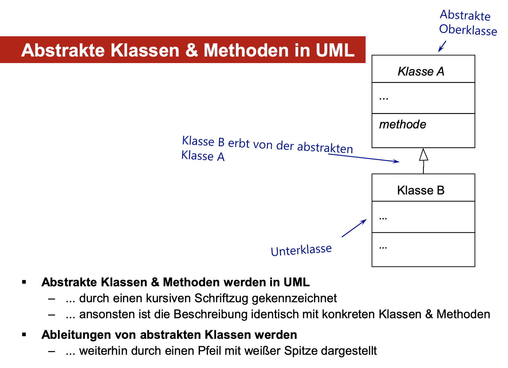

# Abstrakte Klassen

## Was ist abstract
- Das Schlüsselwort `abstract` ist ein Modifikator für Klassen und Methoden, genauer gesagt ein **Nicht-Zugriffsmodifikator**.


## Abstrakte Klasse

Eine Klasse, die mit dem Schlüsselwort abstract deklariert wird:

- Sie kann **nicht** initialisiert werden und dient daher als Bauplan für andere Klassen.

- Sie kann `abstract` und `concrete` Methoden beinhalten
    
    - `abstract` Methode:
        - Besitzt keine Implementierung (Methoden-Inhalt) &rarr; werden nicht befüllt und besitzen kein `{}`.
        - Muss von Unterklassen implementiert werden.

    - `concrete`Methoden:
        - Werden normal vererbt. 

## Unterschiede zu Interfaces:

1. **Implementierung von Methoden**

- Ein Interface darf keine Implementierung für Methoden enthalten (außer default und static Methoden). Es definiert ausschließlich Methoden-Signaturen.  

- Klassen, die ein Interface implementieren, müssen jede dieser Methoden selbst implementieren.

- Eine abstrakte Klasse kann sowohl abstrakte Methoden (ohne Implementierung) als auch konkrete Methoden (mit Implementierung) enthalten.

2. **Mehrfache Vererbung**

- Ein Interface ermöglicht Mehrfachvererbung. Eine Klasse kann beliebig viele Interfaces implementieren (implements InterfaceA, InterfaceB, InterfaceC). Dies ist die Hauptmethode, um in Java Polymorphie zu erreichen, da Java keine Mehrfachvererbung von Klassen erlaubt. Eine Klasse kann nur von einer einzigen abstrakten Klasse erben.
  

## Beispiel Code
Code 1.0 zeigt die abstracte Klasse **Animal** mit einer abstracten Methode und einer normalen befüllten Methode.

```Java
//Code 1.0
public abstract class Animal {
    int age;
    String name;

    //abstracte Methode, die in Unterklassen implementiert werden müssen
    public abstract void makeNoise();
    //keine {} nach der Methode

    //konkrete Methode, die normal vererbt wird
    public void eat(){
        System.out.println("munch munch");
    }
}
```

Code 1.1 zeigt die SubClass (Unterklasse) **Cat**, die von Animal erbt.
```Java
//Code 1.1
public  class Cat extends Animal{


    @Override // <- ist nicht unbedingt notwendig aber best practice
    public void makeNoise() { //geerbte Methode wird hier implementiert
        System.out.println("meow");
    }
}
```

Code 1.2 zeigt die Main in der Cat initialisiert wird und ihre Methoden anwendet.

```Java
//Code 1.2 
public class MainAbstractClasses {
    public static void main(String[] args) {

        Cat myCat = new Cat(); 

        myCat.makeNoise(); //"meow"

        myCat.eat(); //"munch munch"

    }
}
```

## Prog Fragen

1. Was bedeutet Polymorphie?
- siehe [Polymorphie](../Polymorphie/README.md)
- Polymorphie ist die Fähigkeit, eine Variable eines allgemeineren Typs (einer Oberklasse) zu verwenden, um auf Objekte zu verweisen, die von dieser Oberklasse abgeleitet sind. <br> 
    &#10162; Wobei zur Laufzeit dynamisch ermittelt wird, welcher Objekttyp tatsächlich vorliegt und daraufhin die entsprechende Methode des Objekts aufgerufen wird.<br><br>

2. Was muss bei der Konvertierung von Referenzvariablen beachtet werden?<br><br>

Grundsätzlich kann nie ein Objekt in einen Typ konvertiert werden, zu dem es (gemäß der
Klassenhierarchie) keine Verbindung hat.

- **Verbreiternde Konvertierung**
    - ein Objekt einer Unterklasse wird als ein Objekt einer Oberklasse verwaltet &rarr; **Upcast**.<br>
    - Code-Beispiel: `Tier meinFigur = new Rattenhoernchen` Rattenhoernchen wird zu Tier hochgecastet.
    - Upcasting heißt also es wird in der Vererbungs-Hierarchie nach oben gecastet.
    - Upcasting ist erlaubt und wird ohne Cast-Operator automatisch durchgeführt.<br>
    **Einsatz:**<br>
    - Gleiche Verwaltung/gleicher Umgang mit Objekten
    - Allgemeine Methode für unterschiedliche Objekttypen

- **Verengende Konvertierung**
    - ein Objekt wird in den Typ einer vererbten Unterklasse abgeleitet &rarr; **Downcast**
    - Code-Beispiel:<br>
    `Tier meinFigur = new Rattenhoernchen` (upcast)<br>
    `Rattenhoernchen ratte = (Rattenhoernchen) meinFigur`(downcast)
    - es ist ein Cast-Operator nötig
    - Casting wird zu Laufzeit überprüft
    - bei nicht möglicher Konvertierung eine ClassCastException geworfen<br>
**Einsatz:**<br>
    - Zugriff auf Methoden/(Attribute), die nicht bereits in der Oberklasse definiert sind
    - Objekt als Parameter einer Methode (mit geforderten genaueren Typ)<br>
    <br>


3. Können Referenzvariablen in einfache Datentypen konvertiert werden?<br>

- Nein, eine Referenzvariable kann nicht in einen einfachen Datentyp konvertiert werden.
<br><br>
4. Können einfache Datentypen in Java in Referenzvariablen konvertiert werden?

- Ja, einfache Datentypen (primitive Typen) können in Referenzvariablen konvertiert werden. Dies geschieht durch Wrapper-Klassen und wird als **Autoboxing** bezeichnet.

- Jeder primitive Datentyp hat eine entsprechende Wrapper-Klasse:

    - int &rarr; Integer

    - char &rarr; Character

    - boolean &rarr; Boolean   ...  etc.

- Diese Klassen sind Objekte, die den primitiven Wert "einhüllen" (daher der Name "Wrapper"). Seit Java 5.0 übernimmt die Java Virtual Machine (JVM) die Konvertierung automatisch.

Code-Beispiel:<br>
```java
int primitiv = 100;
Integer referenz = primitiv; // Autoboxing: Der primitive int wird automatisch zu einem Integer-Objekt konvertiert.

// `referenz` ist nun eine Referenzvariable, die auf ein Integer-Objekt zeigt.
// Mit diesem Objekt können Methoden der Integer-Klasse aufgerufen werden.
String binärwert = referenz.toBinaryString(primitiv); 
System.out.println(binärwert); // Ausgabe: 1100100
```
 <br>

5. Welche Rolle spielt die Klasse Object in Java?

- Die spezielle Klasse namens Object:
    - Dient als Wurzel der Java-Klassenhierarchie, so dass jede Java-Klasse eine andere Klasse erweitert und ihre Oberklasse und damit alle Referenztypen Teil dieser Klassen-Hierarchie sind

- Sie bildet die Wurzel der Vererbungshierarchie, denn jede Klasse ist vom Obertyp java.lang.Object
- Somit erbt jede Klasse von Object.
- Wenn eine Oberklasse über das Schlüsselwort extends angegeben wurde, dann hat deren Unterklasse durch die Vererbungshierarchie ebenfalls Object als Basisklasse.
- Wenn **KEINE** Oberklasse durch Vererbung angegeben wird, ist das die Basisklasse direkt java.lang.Object
- Durch dieses System ist immer eine Klassenhierarchie gegeben.
<br><br>

6. Was ist eine abstrakte Methode?

- Abstrakte Methoden sind spezielle Methoden, die
    - ... noch keine Funktionalität beschreiben und daher keinen Methoden-Rumpf besitzen
    - ... dadurch können spezifische Details zunächst vernachlässigt werden
    - ... aber trotzdem wird die Möglichkeit der Polymorphie beibehalten

    - Bei der Definition einer abstrakten Methode wird ausschließlich der Methoden-Kopf angegeben, da die eigentliche Definition der Funktionalität (im Methoden-Rumpf) noch offen gelassen wird. Die Definition wird mit einem Semikolon abgeschlossen.

    Code-Beispiel:

    `[public|protected|private| ] abstract datentyp name ([Deklarationsliste]);`
<br><br>

7. Was sind die Eigenschaften von abstrakten Klassen?

- Abstrakte Klassen sind spezielle Klassen, die
    - ... bereits alle Merkmale beschreiben, die alle Unterklassen gemeinsam haben
    - ... aber noch nicht alle Details direkt implementieren müssen

- Schlüsselwort abstract
    - ... wird eine Klasse definiert, die noch nicht alle Details implementiert
    - ... und daher nicht instanziiert werden kann
    - ... sondern zunächst abgeleitet werden muss
    - daher darf sie nicht **final** sein

8. Benötigt eine abstrakte Klasse eine abstrakte Methode und warum ist das so?

- Eine Klasse wird aus folgenden Gründen abstrakt:

    - **Sie enthält mindestens eine abstract Methode**: Wenn Sie eine Methode als abstract deklarieren, müssen Sie die Klasse, die diese Methode enthält, ebenfalls als abstract deklarieren. Eine abstrakte Methode hat nur eine Signatur, aber keinen Implementierungsrumpf.

    - **Sie erbt von einer abstrakten Klasse und implementiert nicht alle geerbten abstrakten Methoden**: Eine Unterklasse, die von einer abstrakten Oberklasse erbt, ist vertraglich verpflichtet, alle geerbten abstrakten Methoden zu implementieren. Wenn sie das nicht tut, muss sie selbst als abstract deklariert werden. Sie "delegiert" die Implementierung quasi an eine weitere Unterklasse.

**Wichtig:**

- static, private und final Methoden können nicht abstrakt sein, weil diese Methoden nicht von abgeleiteten Klassen überschrieben werden können.

- final deklarierte Klasse, können keine abstrakten Methoden enthalten

- Eine von einer abstrakten Klasse abgeleitete Klasse kann nur dann instanziiert werden,
    - ... wenn sie ALLE abstrakten Methoden ihrer Oberklasse überschreibt
    - ... und für jede eine Implementierung bereitstellt

## abstract Klassen und Methoden in UML



## Notizen
Ein "Nicht-Zugriffsmodifikator" in Java ist ein Schlüsselwort, das die Zugriffsebene einer Klasse, eines Feldes oder einer Methode nicht steuert, sondern andere Eigenschaften und Funktionen verleiht.

---

In der Programmierungspraxis bedeutet der Begriff "eine abstrakte Methode implementieren" immer, dass Sie zwei Dinge tun müssen:

Die Methode in der Unterklasse hinzufügen (indem Sie die gleiche Methoden-Signatur verwenden).

Den Code-Block (die Implementierung) für diese Methode schreiben.

Denken Sie an eine abstrakte Methode als ein Versprechen oder eine leere Vorlage. Die Superklasse gibt das Versprechen: "Jede Klasse, die von mir erbt, muss diese Methode haben und ihr einen Sinn geben."

Das Einlösen dieses Versprechens – also das Implementieren – umfasst den gesamten Prozess: Sie müssen die Methode in Ihre Klasse einfügen und sie mit der notwendigen Logik füllen.


